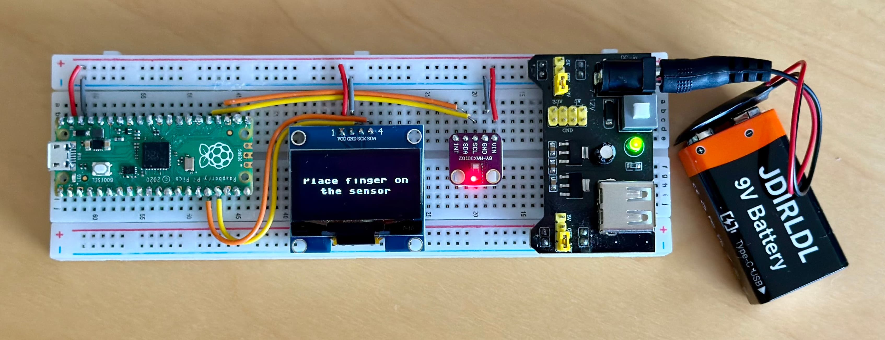
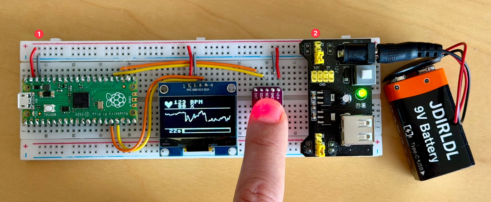

# Heart Vitals Monitor

[](LICENSE)

Heart vitals monitor using Raspberry Pi Pico, a MAX30102 heart rate sensor and a 128×64 OLED display, each connected to the Pico on a separate I2C bus. Implemented with [Claude Code](https://code.claude.com/docs/en/overview).

## Hardware




Important points (marked in the image above):
1. Make sure you connect the power supply to the `VSYS` pin and NOT the `VBUS` pin. This way you can power the Pico both from the micro-USB connection and the power supply board.
2. Make sure you select the `3.3V` pins in the power supply board

Each device uses a dedicated I2C bus, both running at 400 kHz:

| Bus  | Signal | Pin  | Device   |
|------|--------|------|----------|
| I2C1 | SDA    | GP18 | MAX30102 |
| I2C1 | SCL    | GP19 | MAX30102 |
| I2C0 | SDA    | GP12 | SH1106   |
| I2C0 | SCL    | GP13 | SH1106   |

| Device   | Bus  | I2C Address | Notes |
|----------|------|-------------|-------|
| MAX30102 | I2C1 | 0x57        | Pulse-oximeter / heart-rate sensor |
| SH1106   | I2C0 | 0x3C        | 128×64 OLED display |

## Project layout

```
main.py                        # Entry point (runs on boot)
CLAUDE.md                      # Project instructions for Claude Code
lib/
  max30102.py                  # MAX30102 driver (I2C register access, FIFO reads)
  sh1106.py                   # SH1106 OLED driver (I2C, framebuf-based)
test/
  max30102_test.py             # On-device hardware check + heart-rate demo
  sh1106_test.py               # On-device display test suite (DisplayTester class)
doc/
  features/                    # Per-feature documentation (one Markdown file per feature)
```

## Deploying to the board

Use `mpremote` (install with `pip install mpremote`):

## Copy entire project to the board
```bash
mpremote cp -r lib/ test/ *.py :
```

## Copy and run a test file
```bash
mpremote cp test/<test file>.py :test/ + run test/<test_file>.py
```

## Resetting the board
```bash
# Resetting the board
mpremote reset
```

## Running tests

Tests run directly on the Pico — there is no host-side test harness. Connect the board via USB and:

```bash
mpremote run test/max30102_test.py   # Heart-rate acquisition test
mpremote run test/sh1106_test.py     # OLED display test suite
```

Both test files have a `main()` entry point guarded by `if __name__ == "__main__"`.

## How the MAX30102 sensor works

The MAX30102 is a pulse-oximetry and heart-rate sensor that uses **photoplethysmography (PPG)**. It shines red and infrared LEDs into the skin and measures how much light is absorbed by blood flowing through the capillaries.

**Signal path:**

```
LED pulse → skin → photodetector → ADC → 32-sample FIFO → I2C read
```

The on-chip ADC samples at a configurable rate (50–3200 Hz) with programmable averaging (1–32 samples). The host reads 3-byte (18-bit) values per channel from the FIFO register.

**Key registers:**

| Register | Address | Purpose |
|----------|---------|---------|
| FIFO_DATA | 0x07 | Burst-read sample data (3 bytes/channel) |
| FIFO_CONFIG | 0x08 | Sample averaging, FIFO rollover |
| MODE_CONFIG | 0x09 | LED mode (red-only, red+IR), reset, shutdown |
| SPO2_CONFIG | 0x0A | ADC range, sample rate, pulse width |
| LED1/LED2_AMP | 0x0C/0x0D | LED drive current (detection range) |
| PART_ID | 0xFF | Device ID (always 0x15) |

**SpO2 estimation** uses the ratio-of-ratios method: R = (AC_red / DC_red) / (AC_ir / DC_ir), mapped to SpO2 via a linear calibration curve.

## Acknowledgements

- MAX30102 driver originally adapted from the [n-elia MicroPython port](https://github.com/n-elia/MAX30102-MicroPython-driver) of the SparkFun library, rewritten as a lean flat module.
- Built with [Claude](https://claude.ai).

## Features & Fixes

| Date | Description | Document |
|------|-------------|----------|
| 2026-02-18 | Fix ring buffer double-advance causing false "Finger removed" in heart-rate demo | [ring-buffer-pop-fix.md](doc/features/ring-buffer-pop-fix.md) |
| 2026-02-18 | MAX30102 driver rewrite: flat module, lean API, no external deps | [max30102-rewrite.md](doc/features/max30102-rewrite.md) |
| 2026-02-18 | Sensor + OLED integration: live HR/SpO2 display, scrolling waveform, beating heart animation | [heart-vitals-display.md](doc/features/heart-vitals-display.md) |
| 2026-02-17 | Fall back to last known BPM when peak detection temporarily fails | [bpm-fallback-on-peak-failure.md](doc/features/bpm-fallback-on-peak-failure.md) |
| 2026-02-17 | Finger detection to avoid processing noise when no finger is present | [finger-detection.md](doc/features/finger-detection.md) |
| 2026-02-17 | Fix fluctuating heart rate readings with signal processing pipeline | [heart-rate-stabilisation.md](doc/features/heart-rate-stabilisation.md) |

## License

This project is licensed under the MIT License — see the [LICENSE](LICENSE) file for details.
